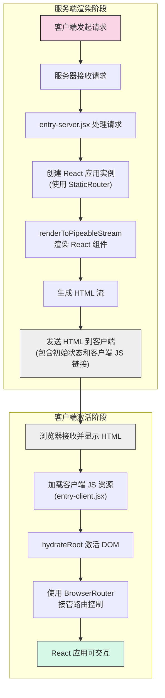

# React SSR 模板

## SSR 基本原理

服务端渲染（Server-Side Rendering，SSR）是一种Web应用渲染方式，主要解决传统SPA（单页应用）首屏加载慢和SEO不友好的问题。本项目是一个基于React 19、Webpack 5的SSR模板实现。

### SSR工作流程

1. **服务端渲染阶段**
   - 服务器接收客户端HTTP请求
   - 创建React应用实例（使用StaticRouter提供路由上下文）
   - 通过`renderToPipeableStream`将React组件渲染为HTML字符串
   - 将HTML发送到客户端浏览器

2. **客户端激活（Hydration）阶段**
   - 浏览器加载服务端返回的HTML和JS资源
   - 通过`hydrateRoot`方法激活页面上的React组件
   - 将静态HTML转换为可交互的React应用

### SSR流程图

### 项目关键文件说明

- **entry-server.jsx**: 
  - 服务端入口文件
  - 使用Express创建Web服务器
  - 通过`renderToPipeableStream`将React应用渲染为HTML流
  - 特别注意：需要对根路径进行监听，否则会出现服务端和客户端渲染不一致的问题

- **entry-client.jsx**: 
  - 客户端入口文件
  - 使用`hydrateRoot`对服务端渲染的HTML进行激活
  - 使用BrowserRouter提供客户端路由能力

- **App.jsx**: 
  - 应用主组件
  - 定义应用路由结构和导航
  - 通过`typeof window === 'undefined'`判断运行环境（服务端/客户端）

### SSR的优势

1. **更快的首屏加载时间**：用户无需等待JS加载和执行便可看到页面内容
2. **更好的SEO表现**：搜索引擎可以直接爬取完整的HTML内容
3. **更好的用户体验**：首屏内容快速呈现，随后无缝过渡为交互式应用

### 注意事项

1. 服务端和客户端渲染的一致性至关重要，否则会导致hydration错误
2. 在entry-server.jsx中需要对根路径进行监听，避免页面刷新时出现不一致问题
3. 服务端不支持某些浏览器API，需要区分环境（`typeof window === 'undefined'`）
4. useEffect等生命周期钩子仅在客户端执行，不会在服务端触发